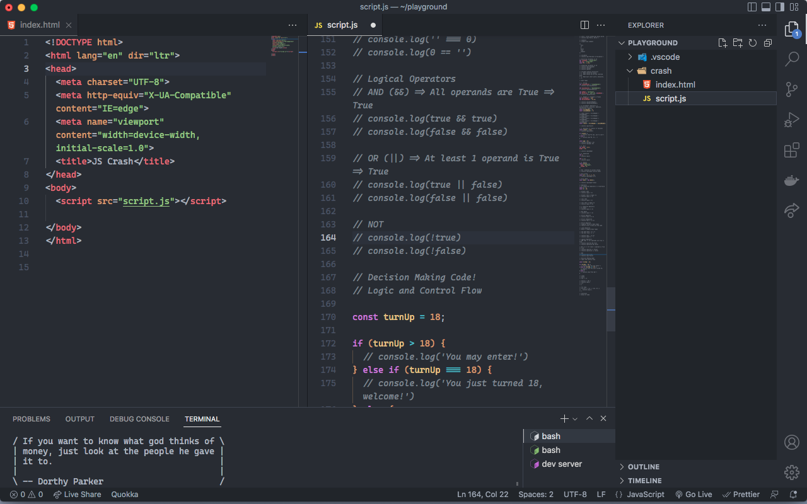

# vs-code-setup



# Font

* Current Font:
  * [Anonymous Pro](https://www.1001fonts.com/anonymous-pro-font.html)

* Alternative Fonts:
  * [cascadia-code](https://github.com/microsoft/cascadia-code)
  * [fira code]()
  
## Theme
* Current Theme:
  * [One Dark Pro](https://marketplace.visualstudio.com/items?itemName=zhuangtongfa.Material-theme)
  
* Alternative Themes:  
  * [Cobalt2](https://marketplace.visualstudio.com/items?itemName=wesbos.theme-cobalt2)
  * [Community Material Theme](https://marketplace.visualstudio.com/items?itemName=Equinusocio.vsc-community-material-theme)
  * [Night Owl](https://marketplace.visualstudio.com/items?itemName=sdras.night-owl)
  
## Extensions
I try to have as few extensions installed as possible, and only install extensions when I need them.

These are the extensions I have installed most of the time:
* [advanced-new-file](https://marketplace.visualstudio.com/items?itemName=patbenatar.advanced-new-file)
  * Prompts you for a directory to save a file instead of opening an untitled file
* [Auto Rename Tag](https://marketplace.visualstudio.com/items?itemName=formulahendry.auto-rename-tag)
  * Automatically renames the closing tag when you make changes to the opening tag
* [Better Comments](https://marketplace.visualstudio.com/items?itemName=aaron-bond.better-comments)
  * Improve your code commenting by annotating with alert, informational, TODOs, and more!
* [Bracket Select](https://marketplace.visualstudio.com/items?itemName=chunsen.bracket-select)
   * Matches brackets/parentheses with a specific color to look aesthetically pleasing & show how they are paired.
* [Docker](https://marketplace.visualstudio.com/items?itemName=ms-azuretools.vscode-docker)
   * Makes it easy to create, manage, and debug containerized applications
* [File Utils](https://marketplace.visualstudio.com/items?itemName=sleistner.vscode-fileutils)
  * Rename files easily using keyboard shortcuts instead of accesing the explorer on the side-bar
* [GitLens](https://marketplace.visualstudio.com/items?itemName=eamodio.gitlens)
   * Powerful extension you can get(pun intended) for working with source control
* [JavaScript(ES6) code snippets](https://marketplace.visualstudio.com/items?itemName=xabikos.JavaScriptSnippets)
   * Code snippets for JavaScript in ES6 Syntax
* [Live Server](https://marketplace.visualstudio.com/items?itemName=ritwickdey.LiveServer)
   * Launch a development local Server with live reload feature for static & dynamic pages
* [Live Share](https://marketplace.visualstudio.com/items?itemName=MS-vsliveshare.vsliveshare)
  * Share a real time collaborative environment for other developers to work on. Great for code reviews, teaching & learning
* [Polacode](https://marketplace.visualstudio.com/items?itemName=pnp.polacode)
  * Allows you to grab code snippets inform of screenshots & share it with other people on twitter, instagram etc
* [Prettier](https://marketplace.visualstudio.com/items?itemName=esbenp.prettier-vscode)
  * Format Code automatically on save or file close 
* [Quokka.js](https://marketplace.visualstudio.com/items?itemName=WallabyJs.quokka-vscode)
  * Automatically runs your JavaScript code in the background & appends the ouput directly in the editor which can facililate rapid prototyping when writing plain JavaScript
* [vscode-icons](https://marketplace.visualstudio.com/items?itemName=vscode-icons-team.vscode-icons)
  * Nice / colorful icons for many different types of files

# Settings

```json
{
  "window.title": "${activeEditorShort}${separator}${rootPath}",
  "workbench.iconTheme": "vscode-icons",
  "workbench.colorTheme": "One Dark Pro",
  "workbench.editor.showTabs": true,
  "workbench.statusBar.visible": true,
  "workbench.sideBar.location": "right",
  "workbench.editor.enablePreview": false,
  "breadcrumbs.enabled": false,
  "editor.linkedEditing": true,
  "editor.fontFamily": "Anonymous Pro",
  "editor.cursorBlinking": "blink",
  "editor.cursorStyle": "line",
  "editor.tabSize": 2,
  "editor.fontSize": 14,
  "editor.fontLigatures": true,
  "editor.formatOnSave": true,
  "editor.wordWrap": "on",
  "editor.hover.enabled": true,
  "editor.guides.bracketPairs": true,
  "editor.rename.enablePreview": false,
  "editor.defaultFormatter": "esbenp.prettier-vscode",
  "emmet.excludeLanguages": ["markdown", "php"],
  "explorer.compactFolders": false,
  "files.autoSave": "afterDelay",
  "files.trimTrailingWhitespace": true,
  "terminal.integrated.tabs.defaultIcon": "terminal-bash",
  "terminal.integrated.sendKeybindingsToShell": true,
  "terminal.integrated.cursorBlinking": true,
  "terminal.integrated.copyOnSelection": true,
  "terminal.integrated.fontSize": 14,
  "terminal.integrated.smoothScrolling": true,
  "php.suggest.basic": false,
  "php.validate.enable": false
}
```

# Keybindings

```json
[
    {
      "key": "cmd+1",
      "command": "workbench.action.openEditorAtIndex1"
    },
    {
      "key": "ctrl+1",
      "command": "-workbench.action.openEditorAtIndex1"
    },
    {
      "key": "cmd+2",
      "command": "workbench.action.openEditorAtIndex2"
    },
    {
      "key": "ctrl+2",
      "command": "-workbench.action.openEditorAtIndex2"
    },
    {
      "key": "cmd+3",
      "command": "workbench.action.openEditorAtIndex3"
    },
    {
      "key": "ctrl+3",
      "command": "-workbench.action.openEditorAtIndex3"
    },
    {
      "key": "cmd+4",
      "command": "workbench.action.openEditorAtIndex4"
    },
    {
      "key": "ctrl+4",
      "command": "-workbench.action.openEditorAtIndex4"
    },
    {
      "key": "cmd+5",
      "command": "workbench.action.openEditorAtIndex5"
    },
    {
      "key": "ctrl+5",
      "command": "-workbench.action.openEditorAtIndex5"
    },
    {
      "key": "cmd+6",
      "command": "workbench.action.openEditorAtIndex6"
    },
    {
      "key": "ctrl+6",
      "command": "-workbench.action.openEditorAtIndex6"
    },
    {
      "key": "cmd+7",
      "command": "workbench.action.openEditorAtIndex7"
    },
    {
      "key": "ctrl+7",
      "command": "-workbench.action.openEditorAtIndex7"
    },
    {
      "key": "cmd+8",
      "command": "workbench.action.openEditorAtIndex8"
    },
    {
      "key": "ctrl+8",
      "command": "-workbench.action.openEditorAtIndex8"
    },
    {
      "key": "cmd+9",
      "command": "workbench.action.openEditorAtIndex9"
    },
    {
      "key": "ctrl+9",
      "command": "-workbench.action.openEditorAtIndex9"
    },
    {
      "key": "ctrl+1",
      "command": "workbench.action.focusFirstEditorGroup"
    },
    {
      "key": "cmd+1",
      "command": "-workbench.action.focusFirstEditorGroup"
    },
    {
      "key": "ctrl+3",
      "command": "workbench.action.focusThirdEditorGroup"
    },
    {
      "key": "cmd+3",
      "command": "-workbench.action.focusThirdEditorGroup"
    },
    {
      "key": "ctrl+6",
      "command": "workbench.action.focusSixthEditorGroup"
    },
    {
      "key": "cmd+6",
      "command": "-workbench.action.focusSixthEditorGroup"
    },
    {
      "key": "ctrl+7",
      "command": "workbench.action.focusSeventhEditorGroup"
    },
    {
      "key": "cmd+7",
      "command": "-workbench.action.focusSeventhEditorGroup"
    },
    {
      "key": "ctrl+2",
      "command": "workbench.action.focusSecondEditorGroup"
    },
    {
      "key": "cmd+2",
      "command": "-workbench.action.focusSecondEditorGroup"
    },
    {
      "key": "ctrl+4",
      "command": "workbench.action.focusFourthEditorGroup"
    },
    {
      "key": "cmd+4",
      "command": "-workbench.action.focusFourthEditorGroup"
    },
    {
      "key": "ctrl+5",
      "command": "workbench.action.focusFifthEditorGroup"
    },
    {
      "key": "cmd+5",
      "command": "-workbench.action.focusFifthEditorGroup"
    },
    {
      "key": "ctrl+8",
      "command": "workbench.action.focusEighthEditorGroup"
    },
    {
      "key": "cmd+8",
      "command": "-workbench.action.focusEighthEditorGroup"
    },
    {
      "key": "cmd+n",
      "command": "extension.advancedNewFile",
      "when": "!terminalFocus"
    },
    {
      "key": "alt+cmd+n",
      "command": "-extension.advancedNewFile"
    }
  ]
  ```
